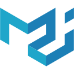

## Hey , I'm [Mudassir Raza](https://mudassirraza.com/), Great to see you here! 

## About Me 🙂
- *A passionate **MERN Stack developer** who writes interesting **bugs***
- *Specializes in **React Native***
- ***Open-source** enthusiast*
- *Ask me about anything, I am happy to help, only if the ball is in my court!😉*

---
<h2 align="center">Statistics 📈 </h2>

     

<!-- ---
<h2 align="center">Languages</h2>

 -->

<!-- --- -->
<!-- <h2 align="center">Contribution Graph 📊</h2>
     -->
  
  
 
---
 <h2 align="center">Tools & Technologies ⚡</h2>

 
  

 
 
 
 
<a href="https://mui.com" target="_blank" rel="noreferrer">  &nbsp; </a> 
 
 
 
  

 
<!--     -->

<!--   -->
 

<!--  -->

## 🏆 GitHub Trophies

 
     

___
<h2 align="center">Let's Connect </h2>

___
<h2 align="center">Support 💰</h2>

<!--
**Mudassirraza912/Mudassirraza912** is a ✨ _special_ ✨ repository because its `README.md` (this file) appears on your GitHub profile.

Here are some ideas to get you started:

- 🔭 I’m currently working on ...
- 🌱 I’m currently learning ...
- 👯 I’m looking to collaborate on ...
- 🤔 I’m looking for help with ...
- 💬 Ask me about ...
- 📫 How to reach me: ...
- 😄 Pronouns: ...
- ⚡ Fun fact: ...
-->

